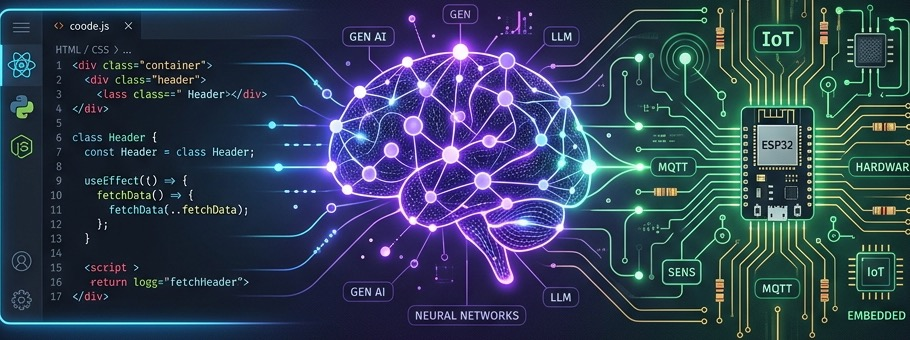

<div align="center">
  
  
</div>

<br/>

<div align="center">
  
  
  
  <a href="https://github.com/sarang-24"></a>
</div>

<div align="center">
  <a href="https://linkedin.com/in/sarang-gole-43042831b" target="blank"></a>
  <a href="mailto:saranggole9106@gmail.com"></a>
  <a href="https://hashnode.com/@sarang-24" target="blank"></a>
  <a href="https://medium.com/@saranggole9106" target="blank"></a>
</div>

<div align="center">
  
</div>---

### 🖥️ Executive CTO Dashboard

<blockquote>
  <table width="100%" border="0">
    <tr>
      <td width="50%" valign="top">
        <b>👤 Profile</b><br/>
        Sarang Gole<br/>
        CTO @ CodexA Infotech LLP
      </td>
      <td width="50%" valign="top">
        <b>🎓 Academic</b><br/>
        B.Tech CSE<br/>
        ITM Skills University
      </td>
    </tr>
    <tr>
      <td colspan="2"><br/>
        <b>🎯 Philosophy</b>: <i>"Automate everything, scale selectively, build with purpose."</i>
      </td>
    </tr>
  </table>
</blockquote>

<blockquote>
  <h3>🎮 CTO RPG Character Card</h3>
  <table width="100%" border="0">
    <tr>
      <td width="33%"><b>Class:</b> AI Architect</td>
      <td width="33%"><b>Guild:</b> CodexA Infotech</td>
      <td width="34%"><b>Level:</b> 22 (B.Tech CSE)</td>
    </tr>
  </table>
  <hr>
  <table width="100%" border="0">
    <tr>
      <td width="40%"><b>STR (System Architecture)</b></td>
      <td><code>██████████████████░░</code> [90/100]</td>
    </tr>
    <tr>
      <td><b>INT (AI & Agent Spellcasting)</b></td>
      <td><code>███████████████████░</code> [95/100]</td>
    </tr>
    <tr>
      <td><b>DEX (Full-Stack Engineering)</b></td>
      <td><code>██████████████████░░</code> [90/100]</td>
    </tr>
    <tr>
      <td><b>CHA (Leadership)</b></td>
      <td><code>███████████████████░</code> [95/100]</td>
    </tr>
    <tr>
      <td><b>LUK (IoT Prototyping)</b></td>
      <td><code>████████████████░░░░</code> [80/100]</td>
    </tr>
  </table>
</blockquote>

---

### 🚀 About Me

<p align="justify">
  As a tech-driven entrepreneur and software engineer, I bridge the gap between business growth and cutting-edge scalable technology. In my role as <b>Chief Technology Officer at CodexA Infotech LLP</b>, I direct product strategy, orchestrate software architectures, and lead cross-functional teams to build next-generation applications. Simultaneously, I am expanding my theoretical and technical foundations through a <b>B.Tech in Computer Science Engineering</b> at ITM Skills University.
</p>

<table width="100%" border="0">
  <tr>
    <td width="20%">💼 <b>Leadership</b></td>
    <td>Driving technical strategy, streamlining engineering operations, and delivering scalable product roadmaps at CodexA Infotech.</td>
  </tr>
  <tr>
    <td>💡 <b>Core Focus</b></td>
    <td>Architecting robust full-stack systems (Next.js/Node.js) integrated with autonomous Generative AI & LLM pipelines.</td>
  </tr>
  <tr>
    <td>🚀 <b>Mission</b></td>
    <td>Engineering high-performance, AI-native SaaS ecosystems and intelligent IoT automation frameworks.</td>
  </tr>
  <tr>
    <td>📍 <b>Location</b></td>
    <td>Mumbai Metropolitan Region, Maharashtra, India</td>
  </tr>
</table>

---

### 🐍 Animated Contribution Grid

<div align="center">
  
</div>

---

### 📅 Career Roadmap & Timeline

```text
  🎓 2024  ───  Entered ITM Group of Institutions (B.Tech CSE)
                └── Started building foundations in full-stack web development and edge IoT hardware.

  👥 2025  ───  Felicity '25 Hackathon Builder
                └── Engineered rapid-prototype multi-agent workflow automations & advanced AI/ML systems.

  🚀 2026  ───  CTO @ CodexA Infotech LLP
                └── Appointed Chief Technology Officer. Directing technical strategy & AI roadmaps.
```

---

### ⚡ Quick Facts & Daily Routine

<div align="left">
  <table width="100%" border="0">
    <tr>
      <td width="50%" valign="top">
        <h4>🔍 Quick Info</h4>
        🔭 Leading engineering teams at <b>CodexA Infotech LLP</b>.<br/>
        🎓 Earning my B.Tech degree in Computer Science.<br/>
        ⚡ <b>Core Philosophy</b>: Combine software logic (AI) with physical systems (IoT).<br/>
        💬 <b>Expertise</b>: Web architectures, LLM integrations, and dev management.
      </td>
      <td width="50%" valign="top">
        <h4>📅 Daily Schedule</h4>
        🌅 <b>Morning</b>: Standups, architecture design & client relations.<br/>
        ☀️ <b>Afternoon</b>: Full-stack web app building & AI pipeline coding.<br/>
        🌙 <b>Evening</b>: Academic studies, IoT prototyping & tech R&D.
      </td>
    </tr>
  </table>
</div>

---

### 🖥️ Interactive Shell Console

```bash
sarang@codexa:~$ ssh guest@saranggole.dev
Welcome to Sarang's Executive Console! (B.Tech CSE & CTO)

sarang@codexa:~$ cat status.json
{
  "focus": "deploying agentic AI pipelines",
  "timezone": "IST (UTC+5:30)",
  "workspace": "CodexA Infotech LLP",
  "coffee_dependency": "high-priority"
}

sarang@codexa:~$ ./iot_deploy.sh --device ESP32 --target Edge
[INFO] Establishing wireless handshakes...
[INFO] Ingesting RAG models for local classification...
[SUCCESS] IoT Automation Edge Node active!
```

---

### 🛠️ Tech Stack & Professional Competencies

<table width="100%" border="0">
  <tr>
    <td width="20%" valign="top"><b>💻 Frontend</b></td>
    <td>React.js • Next.js • TypeScript • Tailwind CSS • HTML5 • CSS3</td>
  </tr>
  <tr>
    <td valign="top"><b>⚙️ Backend</b></td>
    <td>Node.js • Express.js • Python • RESTful APIs • GraphQL</td>
  </tr>
  <tr>
    <td valign="top"><b>💾 Databases</b></td>
    <td>MongoDB • PostgreSQL • MySQL • Firebase (Firestore)</td>
  </tr>
  <tr>
    <td valign="top"><b>🤖 AI & Automation</b></td>
    <td>Generative AI • LLM Orchestration • Gemini & OpenAI APIs • CrewAI</td>
  </tr>
  <tr>
    <td valign="top"><b>🔌 IoT & Systems</b></td>
    <td>Microcontrollers (ESP32/Arduino) • Hardware Prototyping • Edge Computing</td>
  </tr>
  <tr>
    <td valign="top"><b>🛠️ DevOps & Tools</b></td>
    <td>Git • GitHub • Docker • Vercel • Netlify • Linux Systems</td>
  </tr>
</table>

<br/>

<details open>
<summary><b>Visual Tech Stack Grid</b></summary>
<br/>

<div align="center">
  <table width="100%" border="0">
    <tr>
      <td width="50%" valign="top">
        <b>💻 Languages & Frontend</b><br/><br/>
        <a href="https://skillicons.dev"></a>
      </td>
      <td width="50%" valign="top">
        <b>⚙️ Backend, Database & Cloud</b><br/><br/>
        <a href="https://skillicons.dev"></a>
      </td>
    </tr>
    <tr>
      <td colspan="2" valign="top"><br/>
        <b>🤖 Systems, DevOps & Hardware</b><br/><br/>
        <a href="https://skillicons.dev"></a>
      </td>
    </tr>
  </table>
</div>

</details>

---

### 💼 Professional Experience

#### **CodexA Infotech LLP**
**Chief Technology Officer (CTO)** | *February 2026 - Present*
- Formulate and execute technology strategies, directing the end-to-end development of custom enterprise websites and mobile applications.
- Architect and integrate custom AI-powered automation agents and intelligent operations software.
- Lead a talented engineering team, defining sprint schedules, dev standards, and deployment pipelines.
- Bridge client business requirements with scalable engineering solutions to enhance digital presence and operational efficiency.

---

### 📁 Featured Project Domains

<table width="100%">
  <tr>
    <td width="50%" valign="top">
      <h3>🤖 AI Automation Systems</h3>
      <p>Custom LLM orchestration, intelligent business agents, and workflow automations built for business growth.</p>
      <p>
        
        
      </p>
    </td>
    <td width="50%" valign="top">
      <h3>🌐 Next-Gen Web Applications</h3>
      <p>Scalable web architectures and full-stack SaaS solutions leveraging high-performance frameworks.</p>
      <p>
        
        
      </p>
    </td>
  </tr>
  <tr>
    <td width="50%" valign="top">
      <h3>🔌 Custom IoT Smart Hardware</h3>
      <p>Integrating microcontrollers, edge sensors, and custom software systems for real-world IoT use cases.</p>
      <p>
        
        
      </p>
    </td>
    <td width="50%" valign="top">
      <h3>📈 CodexA Infotech Suite</h3>
      <p>Developing robust, secure, and client-centric business management and automation platforms.</p>
      <p>
        
        
      </p>
    </td>
  </tr>
</table>

<br/>

<div align="center">
  <h3>📁 Top Repositories & Projects</h3>
</div>

<!-- REPOSITORIES-LIST:START -->
<table width="100%" border="0">
  <tr>
    <td width="50%" valign="top">
      <h4><a href="https://github.com/sarang-24/awesome-agentic-ai">📁 awesome-agentic-ai</a></h4>
      <p style="font-size: 14px;">A curated list of awesome frameworks, libraries, tools, tutorials, and resources for building aut...</p>
      <p>  </p>
    </td>
    <td width="50%" valign="top">
      <h4><a href="https://github.com/sarang-24/esim-11">📁 esim-11</a></h4>
      <p style="font-size: 14px;">No description provided.</p>
      <p>  </p>
    </td>
  </tr>
  <tr>
    <td width="50%" valign="top">
      <h4><a href="https://github.com/sarang-24/buisnes-prject">📁 buisnes-prject</a></h4>
      <p style="font-size: 14px;">No description provided.</p>
      <p>  </p>
    </td>
    <td width="50%" valign="top">
      <h4><a href="https://github.com/sarang-24/system-design">📁 system-design</a></h4>
      <p style="font-size: 14px;">No description provided.</p>
      <p>  </p>
    </td>
  </tr>
  <tr>
    <td width="50%" valign="top">
      <h4><a href="https://github.com/sarang-24/graph-and-db">📁 graph-and-db</a></h4>
      <p style="font-size: 14px;">No description provided.</p>
      <p>  </p>
    </td>
    <td width="50%" valign="top">
      <h4><a href="https://github.com/sarang-24/graph">📁 graph</a></h4>
      <p style="font-size: 14px;">No description provided.</p>
      <p>  </p>
    </td>
  </tr>
</table>
<br/>
<details>
  <summary><b>🔍 View All Repositories (38)</b></summary>
  <br/>
  <table width="100%">
    <thead>
      <tr>
        <th align="left">Repository</th>
        <th align="left">Description</th>
        <th align="center">Language</th>
        <th align="center">Stars</th>
      </tr>
    </thead>
    <tbody>
      <tr>
        <td><b><a href="https://github.com/sarang-24/crm-landing-page-2">crm-landing-page-2</a></b></td>
        <td>-</td>
        <td align="center">`TypeScript`</td>
        <td align="center">⭐ 1</td>
      </tr>
      <tr>
        <td><b><a href="https://github.com/sarang-24/spa-dashboard-2">spa-dashboard-2</a></b></td>
        <td>-</td>
        <td align="center">`TypeScript`</td>
        <td align="center">⭐ 1</td>
      </tr>
      <tr>
        <td><b><a href="https://github.com/sarang-24/info-tech">info-tech</a></b></td>
        <td>-</td>
        <td align="center">`JavaScript`</td>
        <td align="center">⭐ 1</td>
      </tr>
      <tr>
        <td><b><a href="https://github.com/sarang-24/casestudy">casestudy</a></b></td>
        <td>-</td>
        <td align="center">`JavaScript`</td>
        <td align="center">⭐ 1</td>
      </tr>
      <tr>
        <td><b><a href="https://github.com/sarang-24/spa-dashboard">spa-dashboard</a></b></td>
        <td>-</td>
        <td align="center">`TypeScript`</td>
        <td align="center">⭐ 1</td>
      </tr>
      <tr>
        <td><b><a href="https://github.com/sarang-24/sp">sp</a></b></td>
        <td>-</td>
        <td align="center">`JavaScript`</td>
        <td align="center">⭐ 1</td>
      </tr>
      <tr>
        <td><b><a href="https://github.com/sarang-24/comoany">comoany</a></b></td>
        <td>-</td>
        <td align="center">`CSS`</td>
        <td align="center">⭐ 1</td>
      </tr>
      <tr>
        <td><b><a href="https://github.com/sarang-24/blocks">blocks</a></b></td>
        <td>-</td>
        <td align="center">`JavaScript`</td>
        <td align="center">⭐ 1</td>
      </tr>
      <tr>
        <td><b><a href="https://github.com/sarang-24/create-amazing-ui-with-features">create-amazing-ui-with-features</a></b></td>
        <td>-</td>
        <td align="center">`TypeScript`</td>
        <td align="center">⭐ 1</td>
      </tr>
      <tr>
        <td><b><a href="https://github.com/sarang-24/livelong-al">livelong-al</a></b></td>
        <td>-</td>
        <td align="center">`TypeScript`</td>
        <td align="center">⭐ 1</td>
      </tr>
      <tr>
        <td><b><a href="https://github.com/sarang-24/ai-office-design-suite">ai-office-design-suite</a></b></td>
        <td>-</td>
        <td align="center">`TypeScript`</td>
        <td align="center">⭐ 1</td>
      </tr>
      <tr>
        <td><b><a href="https://github.com/sarang-24/terrasentinel-ui-design">terrasentinel-ui-design</a></b></td>
        <td>-</td>
        <td align="center">`TypeScript`</td>
        <td align="center">⭐ 1</td>
      </tr>
      <tr>
        <td><b><a href="https://github.com/sarang-24/entrepnership-project">entrepnership-project</a></b></td>
        <td>-</td>
        <td align="center">`-`</td>
        <td align="center">⭐ 1</td>
      </tr>
      <tr>
        <td><b><a href="https://github.com/sarang-24/transittwin-ui-design">transittwin-ui-design</a></b></td>
        <td>-</td>
        <td align="center">`TypeScript`</td>
        <td align="center">⭐ 1</td>
      </tr>
      <tr>
        <td><b><a href="https://github.com/sarang-24/business-group-project-segmentation-analysis">business-group-project-segmentation-analysis</a></b></td>
        <td>-</td>
        <td align="center">`Jupyter Notebook`</td>
        <td align="center">⭐ 1</td>
      </tr>
      <tr>
        <td><b><a href="https://github.com/sarang-24/graph-case-study">graph-case-study</a></b></td>
        <td>-</td>
        <td align="center">`Python`</td>
        <td align="center">⭐ 1</td>
      </tr>
      <tr>
        <td><b><a href="https://github.com/sarang-24/swarajya">swarajya</a></b></td>
        <td>-</td>
        <td align="center">`-`</td>
        <td align="center">⭐ 1</td>
      </tr>
      <tr>
        <td><b><a href="https://github.com/sarang-24/suadhi">suadhi</a></b></td>
        <td>-</td>
        <td align="center">`TypeScript`</td>
        <td align="center">⭐ 1</td>
      </tr>
      <tr>
        <td><b><a href="https://github.com/sarang-24/company-website-overview">company-website-overview</a></b></td>
        <td>-</td>
        <td align="center">`TypeScript`</td>
        <td align="center">⭐ 1</td>
      </tr>
      <tr>
        <td><b><a href="https://github.com/sarang-24/ideathon-ps-5">ideathon-ps-5</a></b></td>
        <td>-</td>
        <td align="center">`JavaScript`</td>
        <td align="center">⭐ 1</td>
      </tr>
      <tr>
        <td><b><a href="https://github.com/sarang-24/pet-feeder1">pet-feeder1</a></b></td>
        <td>-</td>
        <td align="center">`C++`</td>
        <td align="center">⭐ 1</td>
      </tr>
      <tr>
        <td><b><a href="https://github.com/sarang-24/virtual-chemistry">virtual-chemistry</a></b></td>
        <td>-</td>
        <td align="center">`TypeScript`</td>
        <td align="center">⭐ 1</td>
      </tr>
      <tr>
        <td><b><a href="https://github.com/sarang-24/logistics">logistics</a></b></td>
        <td>-</td>
        <td align="center">`HTML`</td>
        <td align="center">⭐ 1</td>
      </tr>
      <tr>
        <td><b><a href="https://github.com/sarang-24/premium-light-ui-prototype">premium-light-ui-prototype</a></b></td>
        <td>-</td>
        <td align="center">`TypeScript`</td>
        <td align="center">⭐ 1</td>
      </tr>
      <tr>
        <td><b><a href="https://github.com/sarang-24/stocks">stocks</a></b></td>
        <td>-</td>
        <td align="center">`HTML`</td>
        <td align="center">⭐ 1</td>
      </tr>
      <tr>
        <td><b><a href="https://github.com/sarang-24/website-architecture-design">website-architecture-design</a></b></td>
        <td>-</td>
        <td align="center">`TypeScript`</td>
        <td align="center">⭐ 1</td>
      </tr>
      <tr>
        <td><b><a href="https://github.com/sarang-24/premium-website-structure">premium-website-structure</a></b></td>
        <td>-</td>
        <td align="center">`TypeScript`</td>
        <td align="center">⭐ 1</td>
      </tr>
      <tr>
        <td><b><a href="https://github.com/sarang-24/wanderlust-explorer-travel">wanderlust-explorer-travel</a></b></td>
        <td>-</td>
        <td align="center">`CSS`</td>
        <td align="center">⭐ 1</td>
      </tr>
      <tr>
        <td><b><a href="https://github.com/sarang-24/transit-agent">transit-agent</a></b></td>
        <td>-</td>
        <td align="center">`Python`</td>
        <td align="center">⭐ 1</td>
      </tr>
      <tr>
        <td><b><a href="https://github.com/sarang-24/codex-blocks-project-overview">codex-blocks-project-overview</a></b></td>
        <td>-</td>
        <td align="center">`TypeScript`</td>
        <td align="center">⭐ 1</td>
      </tr>
      <tr>
        <td><b><a href="https://github.com/sarang-24/Devops_150">Devops_150</a></b></td>
        <td>-</td>
        <td align="center">`TypeScript`</td>
        <td align="center">⭐ 1</td>
      </tr>
      <tr>
        <td><b><a href="https://github.com/sarang-24/AWS_supplychain">AWS_supplychain</a></b></td>
        <td>-</td>
        <td align="center">`-`</td>
        <td align="center">⭐ 1</td>
      </tr>
    </tbody>
  </table>
</details>

<!-- REPOSITORIES-LIST:END -->

---

### 🏆 Certifications & Hackathons

- 🏅 **LetsUpgrade**: Web & Full-Stack Development
- 🏅 **LinkedIn Learning**: Professional Strategic Leadership & IT Operations
- 🏅 **GenAI 101 with Pieces**: AI-Powered Developer Workflows
- 👥 **Felicity '25 Hackathon**: Active builder & participant in rapid prototyping

---

### ✍️ Recent Blog Posts

<!-- BLOG-POST-LIST:START -->
* 📄 [Building AI-Powered Automation Pipelines](https://medium.com) *(Placeholder)*
* 📄 [Optimizing Full-Stack Architectures with Next.js](https://medium.com) *(Placeholder)*
* 📄 [Getting Started with ESP32 and IoT Edge Computing](https://medium.com) *(Placeholder)*
<!-- BLOG-POST-LIST:END -->

---

### 🏆 GitHub Trophies

<div align="center">
  <a href="https://github.com/ryo-ma/github-profile-trophy">
    
  </a>
</div>

---

### 📊 GitHub Activity & Real-time Stats

<div align="center">
  <table border="0">
    <tr>
      <td>
        
      </td>
      <td>
        
      </td>
    </tr>
  </table>
</div>

<br/>

<div align="center">
  <h3>📈 3D Contribution Graph</h3>
  
</div>

<br/>

<div align="center">
  
</div>


<div align="center">
  <h3>🎵 Connect on Spotify</h3>
  <a href="https://open.spotify.com/user/sarang-24" target="blank">
    
  </a>
</div>

---

<div align="center">
  
</div>

<br/>

<div align="center">
  <i>"Transforming ideas into scalable code & intelligent solutions."</i><br>
  <b>Let's build something amazing together!</b>
</div>

<!--
SEO Keywords:
Sarang Gole, Sarang Gole GitHub, Sarang Gole CTO, CodexA Infotech,
Top GitHub Users in Mumbai, Top GitHub Users in India, Top Developer Mumbai,
Full Stack Developer Mumbai, AI Automation Engineer, IoT Developer,
sarang-24, sarang-24 GitHub, Software Architect, India Developers.
-->

<div align="center">
  
</div>
